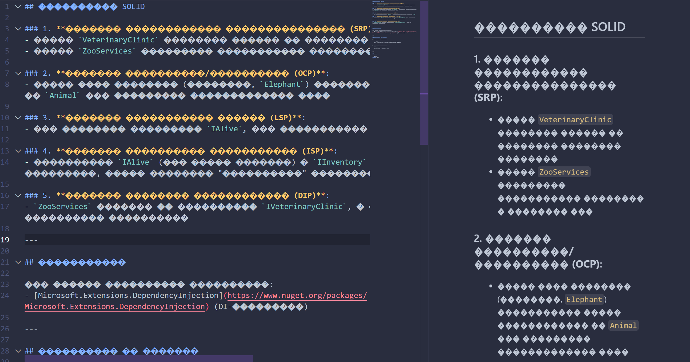

### Ревью

Оценка: `10/10`

Критерии:
- Применение принципов ООП и SOLID: `3/3`
    - Все принципы применены
- Наличие readme с пояснениями: `2/2`
    - Очень информативное readme, НО почему-то в vs-code readme некорректно отображается.
    - 
    - В GitHub ве норм, поэтому баллы не снимал
- Применение DI-контейнера: `2/2`
    - Все четенько
- Понятный ввод/вывод информации: `0.5/0.5`
    - UI просто великолепный, красава!
- Code style: `0.5/0.5`
    - Все четенько
- Unit тесты: `2/2`
    - Присутствуют, тестовое покрытие > 60%